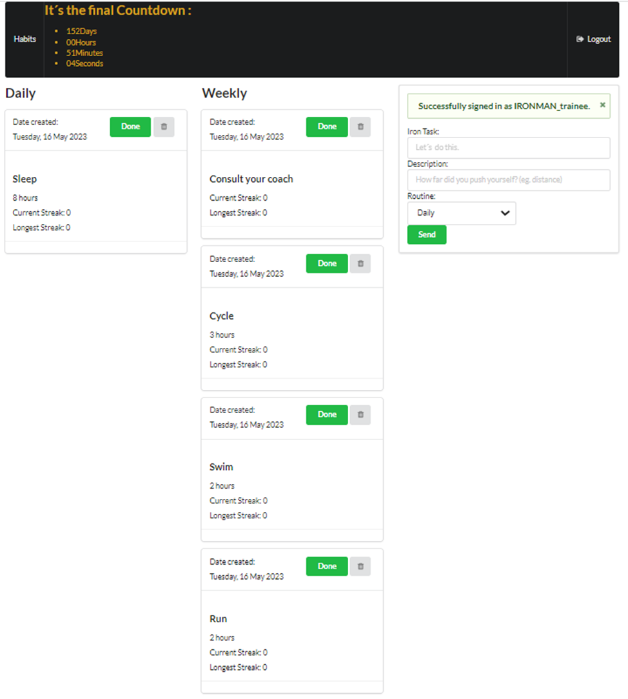
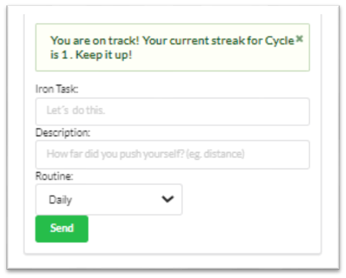

# The Iron App
So you've signed up for your first Ironman, what should you do next? The IRONapp is an online habit-tracker that is specially designed for forming, monitoring and analyzing the habits and training of people attempting this daunting triathlon.

## Installation
Let's get things running by first cloning the repository:
```shell
git clone https://github.com/Monlalakbay/IRONapp.git
```

Then, you can choose to create a virtual environment to install dependencies in and activate it:
```shell
virtualenv2 --no-site-packages env
source env/bin/activate
```

We can then move on, by installing the dependencies, these include the ```django``` library, ```django-allauth``` to ovesee user accounts, and ```pytest``` and etc. for testing. 
```shell
(env) pip install -r requirements.txt
```
The ```(env)``` in front of the prompt shows that your terminal is operating in the new virtual environment.

Once ```pip``` has finished downloading the dependencies, 
it's advisable to make migrations to set up the IRONapp database schema
```shell
(env) python manage.py migrate
```
and finally run the app.
```shell
(env) cd directory path project
(env) python manage.py runserver
```
Take note that what comes after ```(env) cd ``` is the directory path to where the IRONapp folder is located in.


Installation is done! You can go to your browser and navigate to ```http://127.0.0.1:8000/accounts/login/```.

## Walkthrough
Start your IRONapp journey by creating an account. Don't forget to put into the calendar the date of your run. 


Once you've succesully registered, you'll be redirected to your first 5 predetermined "IRON tasks"; that are recommended by the official IRONman organization to start your 6 month training. A countdown is also avaliable so you can pace your training up to your race day. 


You can then proceed onto ticking off the first tasks, creating new tasks, and deleting ones that are no longer needed. 

Ticking off your first task is as simple as clicking the button "Done". We expect the tasks to be demanding, therefore a task cannot be completed more than once within your chosen periodicity (daily or weekly).
If you have followed the routine for your task, a message will apppear and your current streak will increase. If not, another message will appear as a reminder and your current streak goes back to one. The longest streak states what is the maximum recorded tally for a completed task.

On the upper right hand side of the page, you can customize your training and add a new task. Just input a name for the new task (such as "Gym"), a description (optional), and your desired routine (daily or weekly).



## Tests
Before any testing, if you have changed the models of this project (e.g adding a field to the Habit model), it is important to do a migration. 
```shell
(env) python manage.py makemigrations 
(env) python manage.py migrate
```

Proceed to testing:
```shell
(env) pytest . 
```
Note: Please ignore the warning ```RemovedInDjango50Warning``` since it relates to the upcoming update of Django.


